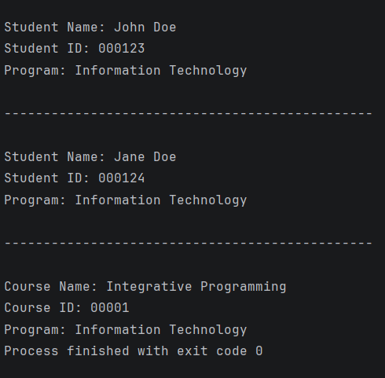
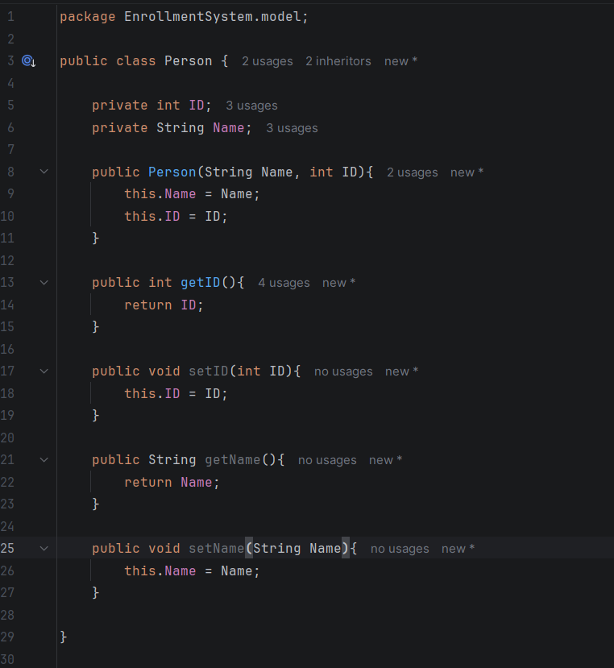

# OOP-Enrollment-System

---
**Author**: John Matthew I. Malabag

**1. Description**

    - Basic Code for OOP-Encapsulation

---

# Inheritance

---
**Author**: John Matthew I. Malabag

**1. Description**

    - Basic code for inheritance changing the old code to make it more clean using the inheritance

